> Feedback welcome: Feel free to leave a message or any hints in the ["General Feedback"](https://github.com/eh2k/squares-and-circles/issues/1) issue.

# □︎●︎ [](https://eh2k.github.io/□●/flash/?firmware) [](https://www.modulargrid.net/e/modules/browser?SearchName=squares+and+circles&SearchShowothers=1)

<!-- ⧉⦾ ⧇ ⟥⧂ -->
**squares-and-circles** is an alternate firmware for the Eurorack module Ornament & Crime (O_C), specifically targeting the Teensy 4.0.

>  <a href="CHANGELOG.txt">CHANGELOG.txt</a>

## ■ Demos

| [](https://www.youtube.com/watch?v=WQj3YqGpxRU) | [](https://youtu.be/QdlwETEaE3A) | [](https://youtu.be/lb-pbm1ddRw) | [](https://youtu.be/J1vmVwwdVU4)
|--|--|--|--|

## Acknowledgments & Credits

Thanks to the creators of ornament & crime (o_C) and PJRC for the Teensy, and all those who have worked on the [code and algorithms](https://github.com/eh2k/squares-and-circles/wiki/credits) that are reused here, especially Mutable Instruments.
They served a great source of learning and provided a huge playground and the foundation for this project.

## Motivation / Challenge

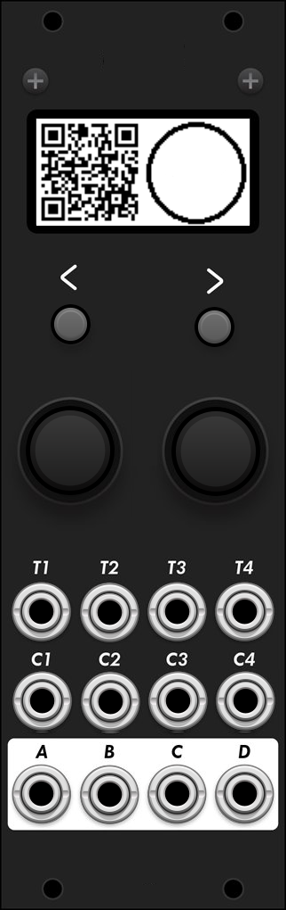


Given are the following ingredients: Two buttons, two encoders and a 128x64 display. Sixteen I/O ports (4x trigs, 4x cv and 4x dac) and a Cortex-M7.

Damn many possibilities to complicate it. Mono, stereo and then again CV. A tricky task to design a simple UI logic, not get lost in menu diving, and to get as much out of the hardware as possible (work in progress).

## Concept

Similar to the Monomachine and Machinedrum, this device features four fully configurable engine instances. Each instance can be assigned a synthesizer, effects, or sequencer engine, which can be controlled via trigger inputs, CV inputs, or clock signals.

The available engine types include drums, synthesizers, oscillators, sequencers, and audio processors. The hardware ports and the generated output signals can be internally routed to any engine. For example, you can route the mono audio signal from an oscillator engine to a neighboring effects engine with stereo outputs, enabling seamless signal chaining.

* [Short Press [LEFT]/[RIGHT]] scrolls through the 4 machine-tracks.
* [Long press [LEFT]] enters the machine-selection-page.
* [Long press [RIGHT]] enters the menu-page.
* [Long press left or right [ENCODER]] shows the modulation popup
* [Long press [L-ENCODER] + [R-ENCODER]] saves the patch - will be restored at startup
  - DEBUG: skip restore - press [RIGHT] button while startup ).

<br/>
<div style="page-break-after: always;"></div>

# Machines <sup>[wiki](https://github.com/eh2k/squares-and-circles/wiki/%E2%96%A1%EF%B8%8E%E2%97%8F%EF%B8%8E-Machines-&-Engines)</sup>


* [Long press [LEFT]] enters the machine-selection-page.<br/>
* [Short press [R-ENCODER]] loads the selected engine.<br/>
* [Long press [R-ENCODER]] loads the selected engine - extended mode.<br/>
   * Load & reset I/O settings
   * Load & keep IO settings 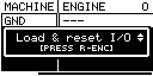
   * Copy #1-4 (parameter values + modulations + I/O settings)

<br/>

---
###### Screenshots
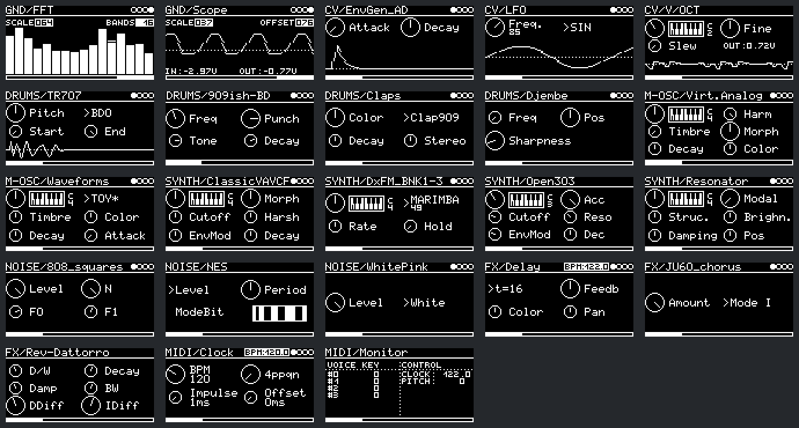

---

## Engines
* **GND**
  * `---`
  * [Scope](https://github.com/eh2k/squares-and-circles/wiki/Scope)
  * [FFT](https://github.com/eh2k/squares-and-circles/wiki/FFT)
* **CV**
  * [V/OCT](https://github.com/eh2k/squares-and-circles/wiki/V_OCT)
  * [EnvGen_AD](https://github.com/eh2k/squares-and-circles/wiki/EnvGen_AD)
  * [EnvGen_ADSR](https://github.com/eh2k/squares-and-circles/wiki/EnvGen_ADSR)
  * [LFO](https://github.com/eh2k/squares-and-circles/wiki/LFO)
  * [EnvFollower](https://github.com/eh2k/squares-and-circles/wiki/EnvFollower)
* **Drums**
  * [Analog-BD](https://github.com/eh2k/squares-and-circles/wiki/Analog-BD),
  * [Analog-SD](https://github.com/eh2k/squares-and-circles/wiki/Analog-SD),
  * [Analog-HH](https://github.com/eh2k/squares-and-circles/wiki/Analog-HH),
  * [Analog-HH2](https://github.com/eh2k/squares-and-circles/wiki/Analog-HH2),
  * [909ish-BD](https://github.com/eh2k/squares-and-circles/wiki/909ish-BD),
  * [909ish-SD](https://github.com/eh2k/squares-and-circles/wiki/909ish-SD),
  * [TR909-HiHat, TR909-Ride](https://github.com/eh2k/squares-and-circles/wiki/TR909_HiHats)
  * [808ish-BD](https://github.com/eh2k/squares-and-circles/wiki/808ish-BD),
  * [808ish-SD](https://github.com/eh2k/squares-and-circles/wiki/808ish-SD),
  * [808ish-HiHat](https://github.com/eh2k/squares-and-circles/wiki/808ish-HiHat),
  * [TR707](https://github.com/eh2k/squares-and-circles/wiki/TR707),
  * [FM-Drum](https://github.com/eh2k/squares-and-circles/wiki/FM-Drum)
  * [Djembe](https://github.com/eh2k/squares-and-circles/wiki/Djembe)
  * [Claps](https://github.com/eh2k/squares-and-circles/wiki/Claps)
* **M-OSC**
  * [Waveforms](https://github.com/eh2k/squares-and-circles/wiki/Waveforms)
  * [Virt.Analog](https://github.com/eh2k/squares-and-circles/wiki/Virt.Analog)
  * [Waveshaping](https://github.com/eh2k/squares-and-circles/wiki/Waveshaping)
  * [2-OP-FM](https://github.com/eh2k/squares-and-circles/wiki/2-OP-FM)
  * [Formant/PD](https://github.com/eh2k/squares-and-circles/wiki/Formant-PD)
  * [Harmonic](https://github.com/eh2k/squares-and-circles/wiki/Harmonic)
  * [Wavetable](https://github.com/eh2k/squares-and-circles/wiki/Waveforms)
  * [Chord](https://github.com/eh2k/squares-and-circles/wiki/Waveforms)
* **SYNTH**
  * [Resonator](https://github.com/eh2k/squares-and-circles/wiki/Resonator)
  * [DxFM](https://github.com/eh2k/squares-and-circles/wiki/DxFM)
  * [DxFM_BNK1-3](lib/plaits/resources.cc#L41)
  * [Open303](https://github.com/eh2k/squares-and-circles/wiki/Open303)
  * [ClassicVAVCF](lib/plaits/dsp/engine2/virtual_analog_vcf_engine.cc)
* **FX**
  * [Reverb](https://github.com/eh2k/squares-and-circles/wiki/clouds_reverb)
  * [ReverbSC](https://github.com/eh2k/squares-and-circles/wiki/ReverbSC)
  * [Rev-Dattorro](https://github.com/eh2k/squares-and-circles/wiki/Rev-Dattorro)
  * [Delay](https://github.com/eh2k/squares-and-circles/wiki/Delay)
  * [Gated-Reverb](https://github.com/eh2k/squares-and-circles/wiki/Gated-Reverb)
  * [Reverb-HP-LP](https://github.com/eh2k/squares-and-circles/wiki/Reverb-HP-LP)
  * [JU60_chorus](https://github.com/eh2k/squares-and-circles/wiki/JU60_chorus)
* **NOISE**
  * [White/Pink](https://github.com/eh2k/squares-and-circles/wiki/White_Pink_noise)
  * [NES_noise](https://github.com/eh2k/squares-and-circles/wiki/NES_noise)
  * [808_squares](https://github.com/eh2k/squares-and-circles/wiki/808_squares)
* **FILTER**
  * [SVF](https://github.com/eh2k/squares-and-circles/wiki/filter_plaits_svf)
  * [MoogLadder](https://github.com/eh2k/squares-and-circles/wiki/moog_ladder)
  * [TeeBee](https://github.com/eh2k/squares-and-circles/wiki/filter_teebee)
* **SPEECH**
  * [LPC](https://github.com/eh2k/squares-and-circles/wiki/LPC)
  * [SAM](https://github.com/eh2k/squares-and-circles/wiki/SAM)
* **MIDI**
  * [Monitor](https://github.com/eh2k/squares-and-circles/wiki/Monitor)
  * [Clock](https://github.com/eh2k/squares-and-circles/wiki/Clock)
  * [VAx6](https://github.com/eh2k/squares-and-circles/wiki/VAx6)
* **SEQ**
  * [EuclidRythm](https://github.com/eh2k/squares-and-circles/wiki/EuclidRythm)
  * [EuclidArp](https://github.com/eh2k/squares-and-circles/wiki/EuclidArp)
  * [TuringMachine](https://github.com/eh2k/squares-and-circles/wiki/TM)

## Machine/Engine

Machines/Engines are controlled by individual parameters.

>[Short press left/right [ENCODER]] changes parameter selection<br/>
>[Rotate left/right [ENCODER]] changes parameter value

### Modulations

>[Long press left or right [ENCODER]] shows/hides the modulation popup*


For each parameter a modulation can be assigned:
  * **CV**: 
    * SRC:
      * `C1`, `C2`, `C3`, `C4` - Analog inputs
        * OP: `THRU`, `S&H-T1`, `S&H-T2`, `S&H-T3`, `S&H-T4`, `T&H-T1`, `T&H-T2`, `T&H-T3`, `T&H-T4`
          * THRU - Thru Input
          * S&H - Sample and Hold
          * T&H - Track and Hold
      * `+` - Constant internal voltage
        * 10V with 1/1000 resolution - nice for fine adjustments (detuning etc)
    * Hints:
      * Parameter 0 (top-left) is primarily used for V/OCT control. Therefore, a single V/OCT signal or CV input can be shared by applying modulation to parameter 0 with an attenuverter set to +1, within the -3V to +6V range. It is also possible to select the V/OCT input in the io-configuration page.
      * All other parameters can be modulated via CV-input with a assumed voltage-range of -4V..4V at 2kHz sample rate.
      * Be aware the CV-range is probably limited by hardware to: -3.5v..6.5V
  * **RND**: Trigger generates a random voltage 
    * TRIG: `!`, `T1`, `T2`, `T3`, `T4`, `C1`, `C2`, `C3`, `C4`
    <br/>
     <br/>
  * **ENV**: Triggered Envelope (Attack, Decay) 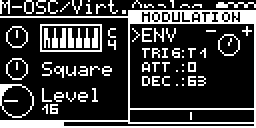

    * TRIG: `!`, `T1`, `T2`, `T3`, `T4`, `C1`, `C2`, `C3`, `C4`
    * ATTACK
    * DECAY
 * **LFO**: Free/Triggered Sine-LFO 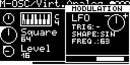
    * TRIG: `-`, `!`, `T1`, `T2`, `T3`, `T4`, `C1`, `C2`, `C3`, `C4`
    * SHAPE: `SIN`, `TRI`, `SQR`, `STEPS`, `NOISE`
    * FREQUENCY: `0-127`
    * WAVEFORM: `0-127`
  * **EF**: Envelope Follower 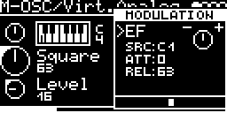
    * SRC: `C1`, `C2`, `C3`, `C4`
    * ATTACK
    * RELEASE
  * **TM**: Turing Machine  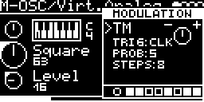
    * TRIG: `!`, `CLK`, `T1`, `T2`, `T3`, `T4`, `C1`, `C2`, `C3`, `C4`
    * PROB: `0-9` (0-100%)
    * STEPS: `1-16`
  * **SEQ**: 4-Step Sequencer 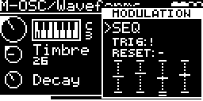
    * TRIG: `!`, `T1`, `T2`, `T3`, `T4`, `C1`, `C2`, `C3`, `C4`, `CLK/1`, `CLK/4`, `CLK/16`, `CLK/32`, `CLK/96`
    * RESET: `-`, `T1`, `T2`, `T3`, `T4`, `C1`, `C2`, `C3`, `C4`
    * 4-STEPS: `-64..64`
 >`!` = current engine trigger<br/>
 >`CLK` = internal clock<br/>
 All modulations have an attenuverter parameter (-/+).
  * The modulation-voltage is attenuverted/multiplied by -1..+1;

<div style="page-break-after: always;"></div>

## I/O-Configuration

>[Long press [RIGHT]] enters the I/O-Configuration page.

The I/O-Configuration page lets you virtually patch the engine with the hardware ports and internal gate/cv signals ($1-$9). Depending on the engine interface, trigger, gate, accent and V/OCT can be configured. In addition to the trigger, which is set with a rising edge, a gate state is also provided, that can be processed by the engine. Engines like Closed/Open-HiHats have an additional accent input - this works technically like a second trigger. The V/OCT input can optionally be quantized and transposed. In addition to the Tx inputs, the Cx inputs can also be used as a source for triggers and accents. The output can be configured as mono or stereo. Several engines can share the same output - the signal is mixed.

### Ctrl / Inputs

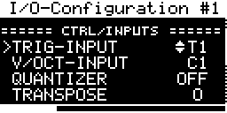

*In case the Engine supports Triggers/Gates - Trigger Input is configurable:*

 * **Trig-Input**:
   * `-`
   * `T1`, `T2`, `T3`, `T4`, `C1`, `C2`, `C3`, `C4`
   * `$1-$9`

*In case the Engine supports Clock-Input - Clock-Source is configurable:*

 * **Clock-Source**:
   * `CLK` - global clock -> Midi/Clock/Timing settings.
   * `T1`, `T2`, `T3`, `T4`, `C1`, `C2`, `C3`, `C4`
   * `$1-$9`

*In case the Engine supports Accents (Closed/Open HiHat) - Accent Input is configurable:*

 * **Accent-Input**:
   * `-`
   * `T1`, `T2`, `T3`, `T4`, `C1`, `C2`, `C3`, `C4`
   * `$1-$9`
   
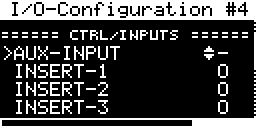

*In case the Engine is an AUDIO_PROCESSOR - Input signal mix is configurable:*
 * **Aux-Input**: `-`, `C1`, `C2`, `C3`, `C4`
   * AUX-IN: -3V..3V for additional audio source for effects (prefer CV4).
 * **Insert-1**: Feed-in signal from engine-1
 * **Insert-2**: Feed-in signal from engine-2
 * **Insert-3**: Feed-in signal from engine-3
 * **Insert-Aux**: Feed-in signal from aux-input

<br/>

 *In case the Engine supports V/OCT - V/OCT Input is configurable:*

 * **CV-Input**: `-`, `C1`, `C2`, `C3`, `C4`
   * V/OCT: -3V..6V for frequency-control (default)
 * **Quantizer**: [Off, Semitones, Ionian, Dorian, ...](lib/braids/quantizer_scales.h)
   * **ROOT**: `C`, `C#`, `D`, `D#`, `E`, `F`, `F#`, `G`, `G#`, `A`, `A#`, `B`
 * **Transpose**: -48 to 24  (semitone per step)
   * **FINE**: semitone/128

*In case MIDI-Control is enabled (Midi-Settings) - Midi-Channel is configurable:*

### Ctrl / Midi


* **Midi-Channel**: `-`, `1`...`16`
  - The Midi messages are translated to analog events
    - Trig: NoteOn
    - Gate: NoteOn until NoteOff
    - CV: 0V = Key 60
  - [Multi-Trig-Drum-Engines](https://github.com/eh2k/squares-and-circles/wiki/DrumSynth)
    - In case trigger to `-` - individual drums/instruments are triggered by individual keys:
        - GM Standard Drum Map: https://github.com/eh2k/squares-and-circles/wiki/TR707#midi-mapping
        - or Keys 60-75 for instrument 1-16

### Mix / Outputs

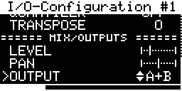

 * **Level**: Output volume level
   - can result in distortion
   - not available on CV-Engines
 * **Pan**: Stereo panning
   - on stereo engines with mono output, panning is also used for mixing
 * **Output**
   * `-`, `A`, `A+B`, `B`, `C`, `C+D`, `D`
     - The option `-(no output)` is useful if the signal is to be routed into an AUDIO_PROCESSOR engine
 * **Stereo**
   * Experimental stereo feature - see STERIOLIZED Flag ;-)
<br/>
<div style="page-break-after: always;"></div>

## MIDI+CLOCK+TIMING-Settings

>[Long press [LEFT] + [RIGHT]] for getting to the MIDI-Settings page.

The MIDI&Clock-Settings page lets you select the MIDI-Control.

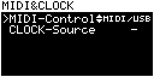

### - **MIDI-Control**:
  - `-` disabled
  - In case OC_T40
    - `USB+T1` [T1 input can be used as MIDI-Input](https://github.com/eh2k/squares-and-circles/wiki/Ornament%E2%80%90and%E2%80%90Crime#-midi-expander)
  - else
    - `MIDI/USB` the USB-MIDI and/or hardware Midi-Input

In case the MIDI-Control is enabled, you can setup the Midi-Channel in the engine IO-settings.
> Each engine can be assigned to a MIDI-Channel - it is possible to control single mono engines together polyphonically (for this all engines have to be set to the same midi channel). [Midi-Engines](app/MIDI/VAx6.cpp) consume the MIDI-Stream directly, therefore the MIDI-Messages are not converted as incoming CVs or triggers.

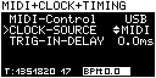

### - **CLOCK-Source**:
   * `-` none
   * `INT` Internal Clock-Source (BPM)
   * `T1` T1 as Clock-Input (4ppqn)
   * `MIDI` Clock received from MIDI

> Default Clock-Source for `SEQ/...` engines. <br/>
> Clock-Source is also used by engines like `FX/Delay` (clocked sync) or `MIDI/Clock`


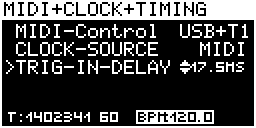

### - **TRIG-In-Delay**: 
   * `0-50ms`Trigger input processing delay in ms. Usecase: sync trig signals with midi or CV

#### Midi-Control
  * Engines can be loaded/selected by midi program change
  * Default Parameter CC-Mappings
    ````
    | HEX | DEC | parameter-index | CH |
    |-----|-----|-----------------|----|
    |  07 |  07 |      LEVEL      |  * |
    |  0A |  10 |       PAN       |  * |
    |  10 |  16 |        0        |  * |
    |  11 |  17 |        1        |  * |
    |  12 |  18 |        2        |  * |
    |  13 |  19 |        3        |  * |
    |  14 |  20 |        4        |  * |
    |  15 |  21 |        5        |  * |
    |  16 |  22 |        6        |  * |
    |  17 |  23 |        7        |  * |
    ````
  > CC 48-56 (HEX 30-38) for LSB (14Bit CC)

# Patch Storage
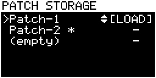

> [Press `L-ENC + R-ENC`] to enter the patch storage page


* Use `L-ENC` for patch slot selection
* Use `R-ENC` for LOAD/SAVE
  * Load `empty` - restores all engines to `GND/-`

# Supported Hardware

 * [Ornament-and-Crime T4.0](https://github.com/eh2k/squares-and-circles/wiki/Ornament%E2%80%90and%E2%80%90Crime)
 * [Squares-and-Circles DSM0](https://github.com/eh2k/squares-and-circles/wiki/Squares&Circles-D_SM-Prototype)
 * [O_C T4.1](https://github.com/eh2k/squares-and-circles/wiki/O_C_T41)

## Hardware setup procedure
  > Use [](https://eh2k.github.io/□●/flash/?firmware)  to enter callibration mode, or execute advanced setup commands </br>
  >Press and hold the [LEFT] button during power-on to enter the setup procedure.

### Display setup


* Press left encoder to flip180.
* Press right encoder for changing display brightness (50%, maximal).

### Encoder setup

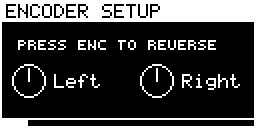

* Check the encoder rotation direction.
* Press encoder for reversed setup.

<br/>
<br/>

### DAC calibration

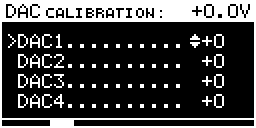

To calibrate the DAC, use a multimeter to accurately set the reference voltages at `0V`, `-2V` and `+2V`.
Start with DAC1 (channel A) - connect the multimeter typically using alligator clip on a patch cable inserted in the jack. Use the right encoder to set the voltage as accurately as possible (press the encoder for coarse adjustment). Do it on all outputs - use the left encoder for channel selection. After calibrating `0V` on all outputs, press [right] to step to the `-2V` calibration. Repeat the procedure and press [right] to calibrating `+2V`.


### ADC calibration


To calibrate the ADC `0V` reference, remove all patch cables from the module. Use the right encoder to adjust the offset (press the encoder for fast adjustment). Do it on all cv-inputs, select the channel with the left encoder. Press [right] to enter the `-2V` calibration. Now you need to connect the DAC outputs to the cv-inputs. The DAC output produces the reference voltage, that is calibrated on the input. Repeat the calibration procedure and step to the `+2V` calibration.

### I/O Test:


* Test/Verify your TRIG or CV inputs.
* The output voltage is set by the cv input voltage (DACx = ADCx).

<br/>

## ⧉ Conclusions and the future

The project started as a kind of personal research in embedded DSP that I did over half a year. At some point, it turned out by chance that the O_C was very well suited for this by only upgrading the Teensy. Apart from the small optional [mod](https://github.com/eh2k/squares-and-circles/wiki/Ornament%E2%80%90and%E2%80%90Crime#optional-dac-voltage-range-mod--5v5v-range) on the DAC voltage range, the current O_C hardware unfortunately has some unchangeable limitations for audio applications. As you know, the Teensy 4.0 doesn't have "high-end" ADCs and a limited amount of RAM. On the other hand, it is the the combination of limitations that make the project unique.

I have mixed feelings about the user interface and the firmware concept. On the one hand, the two buttons and the two encoders are sufficient and actually practical for a multifunction module, but on the other hand, something is missing. Additional buttons/encoders could definitely simplify the operation/interaction - let's see if this [puzzle](https://github.com/eh2k/squares-and-circles/wiki/Squares&Circles-D_SM-Prototype) can be solved.

## License

The application code respectively the suite of machines/engines and the third-party source files are published under permissive software licenses.
For the exact license and copyright holder - see the header of individual source code files or readme/license file in the sub folder.

The firmware as a whole is for personal use only.
If you are considering commercial distributing hardware with this firmware, please contact me (eh2k◯gmx.de).

<!--

````
 _______________
|***************|
|*             *|
|*             *|
|***************|
|               |
| [BL]     [BR] |
|               |
| (EL)     (ER) |
|               |
|( ) ( ) ( ) ( )|
|               |
|( ) ( ) ( ) ( )|
|               |
|( ) ( ) ( ) ( )|
|_______________|
````
-->
