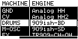
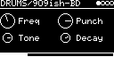
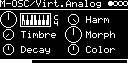
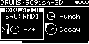
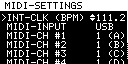
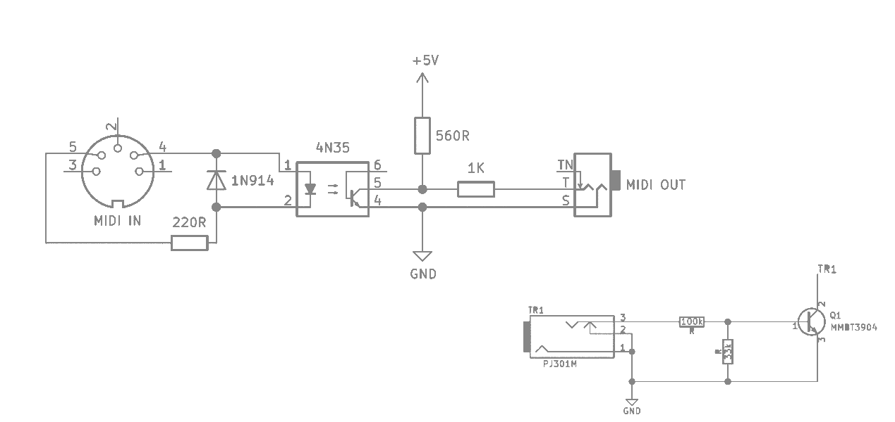
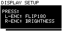
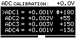
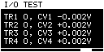

> WORK-IN-PROGRESS: Feel free to leave me a message / feedback or any hints in the ["BETA TEST - FEEDBACK"](https://github.com/eh2k/squares-and-circles/issues/1) issue.

# □︎●︎ [](https://github.com/eh2k/squares-and-circles/actions/workflows/build.yml) [](https://eh2k.github.io/□●/flash/?firmware) [](https://www.modulargrid.net/e/modules/browser?SearchName=squares+and+circles&SearchShowothers=1)

<!-- ⧉⦾ ⧇ ⟥⧂ -->
**squares-and-circles** is an alternate firmware for the Eurorack module O_C, targeting Teensy 4.0.

## ■ Demos 

| [](https://www.youtube.com/watch?v=WQj3YqGpxRU) | [](https://youtu.be/QdlwETEaE3A) | [](https://youtu.be/lb-pbm1ddRw) | [](https://youtu.be/J1vmVwwdVU4)
|--|--|--|--|

## Acknowledgments & Credits

Big thanks to the creators of ornament & crime (o_C) and pjrc for the awesome Teensy. They served a great source of inspiration and provided a huge plaground and the foundation for this project. And many many thanks also to all those who have worked on the [code and algorithms](https://github.com/eh2k/squares-and-circles/wiki/credits) partly reused here, especially Mutable Instruments.

## Motivation / Challenge

 


Given are the following ingredients: Two buttons, two encoders and a 128x64 display. Sixteen I/O ports (4x trigs, 4x cv and 4x dac) and a Cortex-M7.

Damn many possibilities to complicate it. Mono, stereo and then again CV. A tricky task to design a simple UI logic, not get lost in menu diving, and to get as much out of the hardware as possible (work in progress).

## Concept

Similar to Monomachine and Machinedrum here we have basically 4 configurable tracks. Each track can be assigned with a synthesizer machine, controlled by a trigger and CV input. 
As there are mono and stereo machines, the generated audio signal is routed to one or two neighbor DAC outputs by default.
E.g you can chain the mono audio signal from an oscillator machine to the neighbor fx-machine with stereo-outputs.

* [Short Press [LEFT]/[RIGHT]] scrolls through the 4 machine-tracks.
* [Long press [LEFT]] enters the machine-selection-page.
* [Long press [RIGHT]] enters the I/O-configuration-page.
* [Long press [LEFT] + [RIGHT]] enters the MIDI-settings-page.
* [Long press left or right [ENCODER]] shows the modulation popup
* [Long press [L-ENCODER] + [R-ENCODER]] saves the patch - will be restored at startup 
  - DEBUG: skip restore - press [RIGHT] button while startup ).

<br/>
<div style="page-break-after: always;"></div>

# Machines <sup>[wiki](https://github.com/eh2k/squares-and-circles/wiki/%E2%96%A1%EF%B8%8E%E2%97%8F%EF%B8%8E-Machines-&-Engines)</sup>

 

<sup>[Long press [LEFT]] enters the machine-selection-page.</sup>

* **GND**
  * `---`
* **CV**
  * V/OCT, Envelope, LFO, Noise
* **Drums** 
  * Analog-BD, Analog SD, Analog HH, Analog HH2
  * 909ish-BD, 909ish-SD, TR909-HiHat, TR909-Ride
  * 808ish-BD, 808ish-SD, 808ish-HiHat
  * TR707, TR707-HiHat
  * FM-Drum
  * Djembe
  * Clap
* **M-OSC** 
  * Waveforms 
  * Virt.Analog, Waveshaping, FM, Grain, Additive, Wavetable, Chord
  * Resonator
* **SYNTH**
  * [DxFM](https://github.com/eh2k/squares-and-circles/wiki/DxFM)
  * [Open303](https://github.com/eh2k/squares-and-circles/wiki/Open303)
* **Stereo-FX**
  * Reverb, ReverbSC, Rev-Dattorro, Delay, Gated-Reverb, Reverb-HP-LP
* **SPEECH**
  * LPC, SAM
* **MIDI**
  * Monitor, Clock, VAx6

## Machine/Engine  


Machines/Engines are controlled by individual parameters.

* [Short press left/right [ENCODER]] changes parameter selection

* [Rotate left/right [ENCODER]] changes parameter value

### Modulations



<sup>[Long press left or right [ENCODER]] shows/hides the modulation popup</sup>

For each parameter a modulation can be assigned:
  * **CV**:
    * SRC: `C1`, `C2`, `C3`, `C4`
    * OP: `THRU`, `S&H-T1`, `S&H-T2`, `S&H-T3`, `S&H-T4`, `T&H-T1`, `T&H-T2`, `T&H-T3`, `T&H-T4`
      * THRU - Thru Input
      * S&H - Sample and Hold
      * T&H - Track and Hold
    * Hints:
      * Parameter 0 (top-left) is mainly used for V/OCT control. Thus, one single V/OCT signal / CV-Input can be shared by using modulation on parameter-0 with attenuverter = +1 (-3V..+6V) range. It is also possible to select the V/OCT input in the io-configuration page.
      * All other parameters can be modulated via CV-input with a assumed voltage-range of -4V..4V at 2kHz sample rate.
      * Be aware the CV-range is probably limited by hardware to: -3.5v..6.5V
  * **RND**: Trigger generates a random voltage
    * TRIG: `!`, `T1`, `T2`, `T3`, `T4`, `C1`, `C2`, `C3`, `C4`
  * **ENV**: Triggered Envelope (Attack, Decay)
    * TRIG: `!`, `T1`, `T2`, `T3`, `T4`, `C1`, `C2`, `C3`, `C4`
    * ATTACK
    * DECAY
 * **LFO**: Free/Triggered Sine-LFO
    * TRIG: `-`, `!`, `T1`, `T2`, `T3`, `T4`, `C1`, `C2`, `C3`, `C4`
    * SHAPE
    * FREQUENCY
  * **EF**: Envelope Follower
    * SRC: `C1`, `C2`, `C3`, `C4`
    * ATTACK
    * RELEASE
 > <sup>`!` = current engine trigger</sup>  
 
 All modulatiuonation have an attenuverter parameter (-/+).
  * The modulation-voltage is attenuverted/multiplied by -1..+1;

<div style="page-break-after: always;"></div>

## I/O-Configuration 

<sup>[Long press [RIGHT]] enters the I/O-Configuration page.</sup>

The I/O-Configuration page lets you virtually patch the engine with the hardware ports. Depending on the engine interface, trigger, gate, accent and V/OCT can be configured. In addition to the trigger, which is set with a rising edge, a gate state is also provided, that can be processed by the engine. Engines like Closed/Open-HiHats have an additional accent input - this works technically like a second trigger. The V/OCT input can optionally be quantized and transposed. In addition to the Tx inputs, the Cx inputs can also be used as a source for triggers and accents. The output can be configured as mono or stereo. Several engines can share the same output - the signal is mixed.

### Ctrl / Inputs


*In case the Engine supports Triggers/Gates - Trigger Input is configurable:*

 * **Trig-Input**: 
   * `-`
   * `T1`, `T2`, `T3`, `T4`, `C1`, `C2`, `C3`, `C4` 
  
 *In case the Engine supports V/OCT - V/OCT Input is configurable:*

 * **CV-Input**: `-`, `C1`, `C2`, `C3`, `C4`
   * V/OCT: -3V..6V for frequency-control (default)
 * **Quantizer**: [Off, Semitones, Ionian, Dorian, ...](lib/braids/quantizer_scales.h)
 * **Transpose**: -48 to 24  (default -24)

*In case the Engine supports Accents (Closed/Open HighHat) - Accent Input is configurable:*

 * **Accent-Input**: 
   * `-`
   * `T1`, `T2`, `T3`, `T4`, `C1`, `C2`, `C3`, `C4` 


*In case the Engine is an AUDIO_PROCESSOR - Input signal mix is configurable:*
 * **Aux-Input**: `-`, `C1`, `C2`, `C3`, `C4` 
   * AUX-IN: -3V..3V for additional audio source for effects (prefer CV4).
 * **Insert-1**: Feed-in signal from engine-1
 * **Insert-2**: Feed-in signal from engine-2
 * **Insert-3**: Feed-in signal from engine-3
 * **Insert-Aux**: Feed-in signal from aux-input

<br/>

### Mix / Outputs


 * **Level**: Output volume level
   - can result in distortion
   - not available on CV-Engines
 * **Pan**: Stereo panning
   - on stereo engines with mono output, panning is also used for mixing
 * **Output**
   * `-`, `A`, `A+B`, `B`, `C`, `C+D`, `D`
     - The option `-(no output)` is useful if the signal is to be routed into an AUDIO_PROCESSOR engine
   
<br/>
<div style="page-break-after: always;"></div>

## MIDI-Settings 

<sup>[Long press [LEFT] + [RIGHT]] enters the MIDI-Settings page.</sup>

The MIDI-Settings page lets you select the MIDI-Input. MIDI via USB is active by default - alternatively the [T1 input can be used as MIDI-Input](#-midi-expander). Each engine can be assigned to a MIDI-Channel - it is possible to control single mono engines together polyphonically (for this all engines have to be set to the same midi channel). [Midi-Engines](src/polyVA.cxx) consume the MIDI-Stream directly, therefore the MIDI-Messages are not converted as incoming CVs or triggers.



 * **MIDI-CLK/INT-CLK**: BPM
   * *In case clock is send via MIDI the internal clock is feed by midi, else the internal clock is active and can be set*
 * **MIDI-Input**: USB, T1 
   * *In case T1 is set - T1 is working in Midi-Mode (Serial) - Triggering is not available on T1*
 * **MIDI_CH #**: 1-16, single channel on multiple engines, for polyphony

#### Midi-Control
  * Engines can be loaded/selected by midi program change
  * Default Parameter CC-Mappings
    ````
    | HEX | DEC | parameter-index | CH |
    |-----|-----|-----------------|----|
    |  20 |  32 |        0        |  * |
    |  21 |  33 |        1        |  * |
    |  22 |  34 |        2        |  * |
    |  23 |  35 |        3        |  * |
    |  24 |  36 |        4        |  * |
    |  25 |  37 |        5        |  * |
    |  26 |  38 |        6        |  * |
    |  27 |  39 |        7        |  * |
    ````

#### **⦾ Midi-Expander**
   
   Trigger-port TR1 is also suitable for Midi-In.
   Although the connection does not comply with the [MIDI standard](https://minimidi.world/?fbclid=IwAR31TqOyRkvdwaLYCxoU2a89hcy2PF3hltCtRKD7IzD5HbZqzn3m9NmiZzc#types) - for me this solution is more practical than the alternative via USB.
   

<div style="page-break-after: always;"></div>

# Supported Hardware  

## Ornament-and-Crime
### Build-guide
  * http://ornament-and-cri.me/ 
  * https://github.com/jakplugg/uO_c

### Teensy4.x - required drop-in replacement for Teensy3
  * CPU speed at 500MHz (~100mA power draw on +12V bus)
  * DAC operation at 48kHz per channel
  * ADC 12-bit (10bit + noise)
> **HINT**:
  if the [POGO Pin](https://www.modwiggler.com/forum/viewtopic.php?p=2867702#p2867702) is soldered - cover the bottom of the teensy with insulating tape - all other pins are compatible with T4 to T3 (see pjrc). Be careful with connecting USB and power at the same time - if you have VIN/VUSB connected.

### Optional DAC-voltage-range-mod (-5V..+5V Range)
  * O_C DAC was initially designed for CV-control within range from -3.75V to +6.25V. 
  * The range is not ideal for audio A/C signals in the Eurorack. However, it is easily possible to lower the range to -5V..+5V.
    * 
  * In the same way as raising the level ([see description](https://ornament-and-cri.me/hardware-basics/)), you can bring the V_bias (default 1.25V) to ~1.0V by modifying the voltage divider. Instead of the two 47K resistors, the ratio should be about 47K / 31.2K - one possibility would be to [solder a 100K resistor in parallel to the lower 47K resistor (uO_C:R14).](http://lushprojects.com/circuitjs/circuitjs.html?ctz=CQAgjCAMB0l3BWEBmATNA7AhAOBjVIAWfbEInEJfKgUwFowwAoAJXFUqdRADYjwYHpHDkRYaKiQSpUKNATMAhiCm8OlImg0guPRjzDx44WELABOZFuRwcnPKcjmSGChZwY8W8McjMAJx1uVUguITlUIgs4ZgB3UPCeNUFhQNUEdRForLkjY2YAYwz1bS0ebRF0Swtauvq6nAYmKkwcSAQLBCIMfmQcVyQYOBYElJCU-ih4kr4BFIppsczyShTKmfKUHi2p-wTdgS2hSn3yC3UTqgtDTmmg47ucnSrCGfXklZEz56vn7-eKzARAEYEuIPuIHo2mBAmhhhuch68HS8JAFyhMIh2QwKIA5piEfptIRTtN2GiMfQphjvmJVAo5N8FOkweAIWzLMJfAUEpzEWiuUtwOC4ViBP4APZyParXgYXzyeCWBDIIRDVRyZDMaUtWVESC1UJK+AWXqZWQQUEQZDgDVgJDaoA) 

## Hardware setup procedure 
  > Use [](https://eh2k.github.io/□●/flash/?firmware)  to enter callibration mode, or execute advanced setup commands </br>
  >Power on the module with the [LEFT] button pressed for entering the setup procedure.

### Display setup



* Press left encoder to flip180.
* Press right encoder for changing display brightness (50%, maximal). 

### Encoder setup


* Check the encoder rotation direction.
* Press encoder for reversed setup. 

<br/>
<br/>

### DAC calibration


To calibrate the DAC, you need a multimeter. Besides the reference voltage of `0V`, the voltages `-2V` and `+2V` should be calibrated as accurately as possible.
Start with DAC1 (channel A) - connect the multimeter typically using alligator clip on a patch cable inserted in the jack. Use the right encoder to set the voltage as accurately as possible (press the encoder for coarse adjustment). Do it on all outputs - use the left encoder for channel selection. After calibrating `0V` on all outputs, press [right] to step to the `-2V` calibration. Repeat the procedure and press [right] to calibrating `+2V`. 


### ADC calibration



To callibrate the ADC `0V` reference, remove all patch cables from the module. Use the right encoder to adjust the offset (press the encoder for fast adjustment). Do it on all cv-inputs, select the channel with the left encoder. Press [right] to enter the `-2V` calibration. Now you need to connect the DAC outputs to the cv-inputs. The DAC output produces the reference voltage, that is calibrated on the input. Repeat the calibration procedure and step to the `+2V` calibration.

### I/O Test: 


  
* Test/Verify your TRIG or CV inputs. 
* The output voltage is set by the cv input voltage (DACx = ADCx).

<br/>

## ⧉ Conclusions and the future 
 
The project was originally a kind of research that I did over half a year. The current O_C hardware could certainly be optimized. As you know, the DAC and the display share the SPI port - this is not ideal for simultaneous operation. Furthermore, the Teensy 4.0 does not have "high-end" ADCs - my focus here was to achieve operation at audio rate (aux input) - the issue of noise has not been the focus so far.

At the moment I like to make the project partially available to the community as open-source, so that everyone has the possibility to adapt and experiment with it. 

## License

The application code respectively the suite of machines/engines is released under permissive software licenses. 
For licenses e.g. the copyright holders of 3rd-party libraries - see the header of individual source code files or readme/license file in the sub folder.

The previously mentioned "libmachine", a hardware abstraction layer, will remain "closed source" until I follow some not yet discarded ideas. This is to prevent the firmware from being forked/ported to similar digital Eurorack modules and some theoretical licensing questions. 
If you consider commercially distributing hardware with this firmware, please contact me (eh2k◯gmx.de). 

<!--
````
 _______________
|***************|
|*             *|
|*             *|
|***************|
|               |
| [BL]     [BR] |
|               |
| (EL)     (ER) |
|               |
|( ) ( ) ( ) ( )|
|               |
|( ) ( ) ( ) ( )|
|               |
|( ) ( ) ( ) ( )|
|_______________|
````
-->

